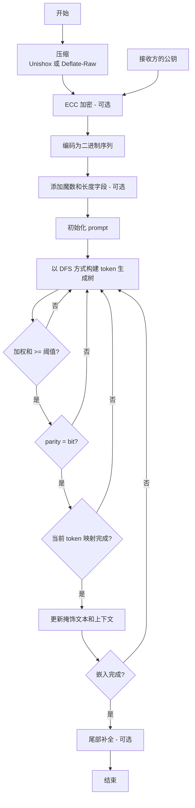

[简体中文](README.md) | [English](README_en.md)

# StegLLM

一款离线的 AI 工具，能将你的秘密信息巧妙地伪装成一段普通文字。
> 和加密不同，隐写的核心是**让人根本不知道信息的存在**。

## 一些有趣的应用场景

- **传递小秘密**：  
  想给朋友发个“只有我们才懂”的小秘密？藏在一段看似平常的文字里，让其他人完全无法察觉。
- **添加水印**：  
  在你的小说或文章中，嵌入隐形的署名或日期，证明这是你的原创。
- **躲猫猫游戏**：  
  在公共论坛或社交媒体上，把你的真实想法藏在一篇关于电影或美食的评论里。
- **代码恶作剧**：  
  把秘密指令藏进日志文件或代码注释中，给你的程序下达秘密任务！

## 快速开始
- **仅解密：** 访问 https://rin313.github.io/StegLLM/

这是一个只包含解密功能的网页，你可以在这里看到基本的演示界面。

- **隐写 + 解密：**

下载[StegLLM.zip](https://github.com/Rin313/StegLLM/releases)

Windows 系统：运行 `windows.bat`

Linux/MacOS 系统：运行 `linux_mac.sh`

## 使用自定义的模型（可选）

从 **Hugging Face** 或 **ModelScope** 等任何来源获取**gguf**文件，然后在项目目录的**data**文件夹中对 gguf 文件进行替换。

## 原理图

## 免责声明

本项目仅供学习和研究使用，请勿用于非法用途。对于因使用本项目造成的任何损失或损害，作者不承担任何责任。

特别感谢：**[LLM-Steganography](https://github.com/HighDoping/LLM-Steganography/),[llama.cpp](https://github.com/ggml-org/llama.cpp),[Unishox2](https://github.com/siara-cc/Unishox2)**
