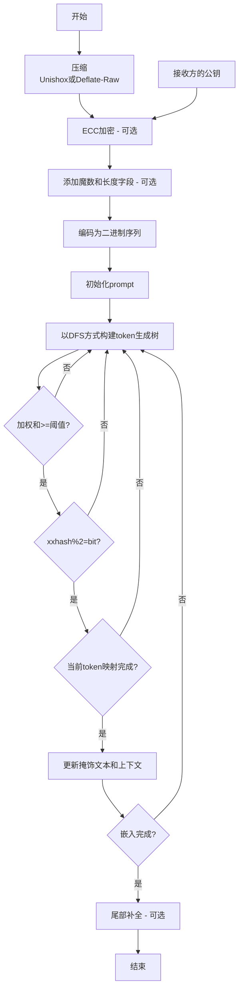

[简体中文](README.md) | [English](README_en.md)
# StegLLM

StegLLM 是一个离线的文本隐写项目，它利用大语言模型LLM在正常的文本中隐藏秘密信息。无需安装或任何配置，即可在本地安全地进行隐写加密。

## 什么是文本隐写？

想象一下，你可以把一句话悄悄藏在一篇文章里，不被人轻易发现。

这就是文本隐写：把你想隐藏的信息融入到看似普通的文字中。

和加密不同，隐写的核心是**让人根本不知道信息的存在**。

## 文本隐写有什么“妙用”？

*   **传递小秘密：** 想给朋友发个“只有我们才懂”的小秘密？藏在一段看似平常的文字里，让其他人完全无法察觉。
*   **给作品加个“防伪码”：** 在你呕心沥血写成的小说里，偷偷加入一些只有你知道的“彩蛋”，证明这是你的原创。
*   **躲猫猫游戏：** 在公共场合，我们可能想要让一些信息“隐身”，藏进普通的内容里。就像玩捉迷藏一样，看看谁能找到我！
*   **代码恶作剧：** 想让你的程序在“无人知晓”的情况下执行一些特别的操作？把秘密指令藏进一段普通的日志文件或代码注释中，给你的程序下达秘密任务！

# 快速开始

下载[StegLLM.zip](https://github.com/Rin313/StegLLM/releases)

Windows系统：运行 `windows.bat`

Linux/MacOS系统：运行 `linux_mac.sh`

界面演示


如图所示，输入想要隐藏的内容和隐写提示，即可生成一段自然的文本。

# 使用自定义的模型（可选）

从 **Hugging Face** 或 **ModelScope** 等任何来源获取**gguf**文件，然后在项目目录的**data**文件夹中对gguf文件进行替换。

# AI角色设置（可选）

设置`system_prompt.txt`

```json
{
  "system_prompt": {
    "prompt": "You are a creative writing assistant.Your task is to continue the input text in a natural, fluent, and imaginative way, following the style and tone of the input.If the input is empty, start a new story or paragraph creatively.Ensure your continuation is grammatically correct and engaging, using natural language expressions.",
    "assistant_name": "Continuation Assistant:"
  }
}
```

# 原理图



# 贡献

欢迎提交 Issues 和 Pull Requests！

# 免责声明

本项目仅供学习和研究使用，请勿用于非法用途。对于因使用本项目造成的任何损失或损害，作者不承担任何责任。

本项目采用 [MIT 许可证](LICENSE)。

特别感谢：**[LLM-Steganography](https://github.com/HighDoping/LLM-Steganography/),[llamafile](https://github.com/Mozilla-Ocho/llamafile),[Unishox2](https://github.com/siara-cc/Unishox2)**
