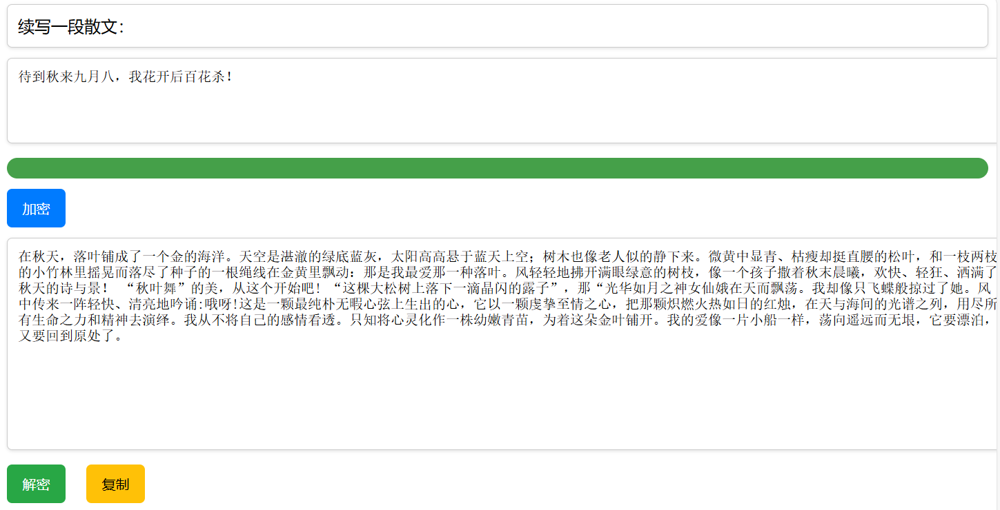
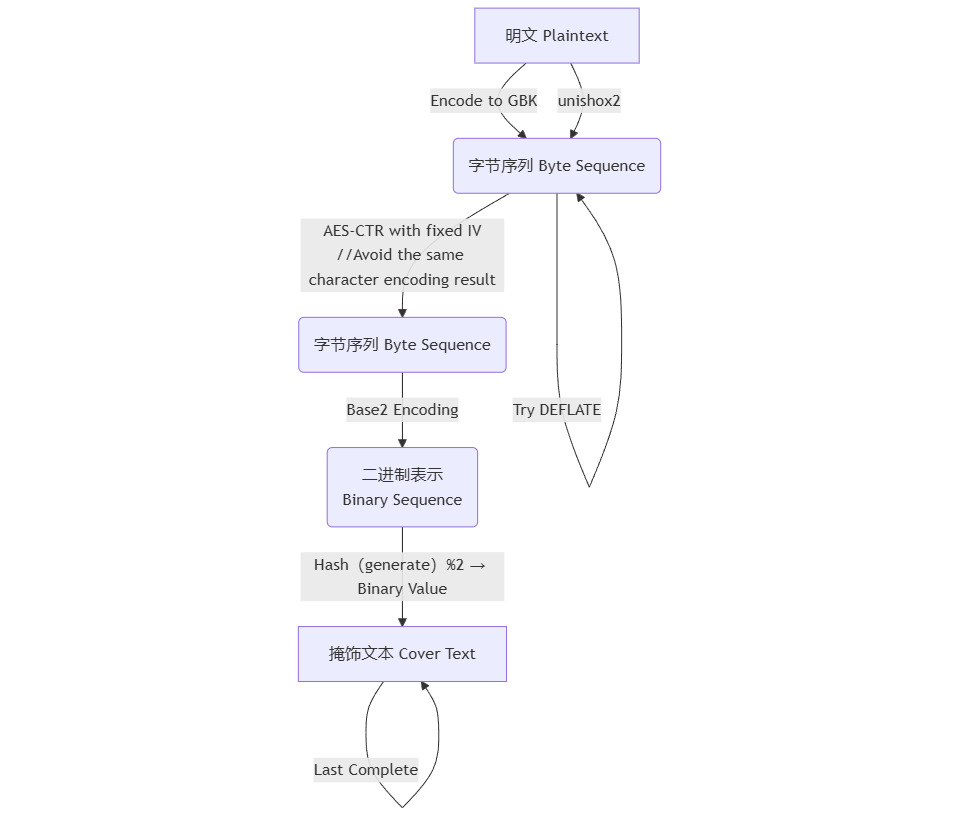

# StegLLM

StegLLM 是一个完全离线的使用LLM进行文本隐写的项目，无需安装或任何额外配置。截至目前，只支持中文作为掩饰文本。

特别感谢：**[LLM-Steganography](https://github.com/HighDoping/LLM-Steganography/),[llamafile](https://github.com/Mozilla-Ocho/llamafile),[Unishox2](https://github.com/siara-cc/Unishox2)**

**注意：本项目目前处于实验阶段，隐写效果和稳定性有待进一步提高。**

# 快速开始

下载预构建版本[StegLLM-1.0.zip](https://github.com/Rin313/StegLLM/releases/tag/release-1.0)，默认使用的模型是 `Qwen2.5-0.5B-Instruct-Q6_K`

Windows：运行 `windows.bat`

Linux/MacOS：
1. 项目目录下执行下列指令，授予llamafile执行权限
```bash
chmod +x *
```
2. 运行 `linux_mac.sh`

隐写示例及UI界面预览



# 使用自定义的模型构建

1. 下载[StegLLM-1.0-pure.zip](https://github.com/Rin313/StegLLM/releases/tag/release-1.0)
2. 从 **Hugging Face** 或 **ModelScope** 等任何来源获取希望使用的llamafile文件，放置到项目目录下的**data**文件夹中。

一般来说，使用参数较大的模型，可以获得更好的隐写效果。

**Windows 用户注意事项:**

如果在 Windows 下运行大于 4GB 的 llamafile，需要进行一些额外的操作。请参考 [Mozilla-Ocho/llamafile](https://github.com/Mozilla-Ocho/llamafile) 的官方文档。

# 续写提示设置（可选）

设置`prompts.txt`

```javascript
const prompts=[
`续写一段散文：`,
`续写一段仙侠小说：`,
];
```

# AI角色设置（可选）

设置`system_prompt.txt`

```json
{
    "system_prompt": {
        "prompt": "你是擅长散文和小说的中国浪漫主义作家，只创作充满情感，幻想和哲理的文字。你在续写文章时词汇丰富，经常使用不常规的词语和语法，并且绝对不会添加标题、作者、序号、提示等任何额外的信息或说明。",
        "assistant_name": "Assistant:"
    }
}
```

# 注意事项
*   加密过程可能需要较长时间，请将页面保持在后台，耐心等待。
*   由于语法惯性和模型体量的限制，加密过程可能无法找到合适的选词进行编码。遇到这种情况时，请重新尝试。
*   对于加密后得到的掩饰文本，尾部文本插入对解密的影响较小，头部插入和中间修改则不支持。

# 原理图



# 贡献

欢迎提交 Issues 和 Pull Requests！

# 许可证

本项目采用 [MIT 许可证](LICENSE)。

# 免责声明

本项目仅供学习和研究使用，请勿用于任何非法活动。对于因使用本项目造成的任何损失或损害，作者不承担任何责任。
