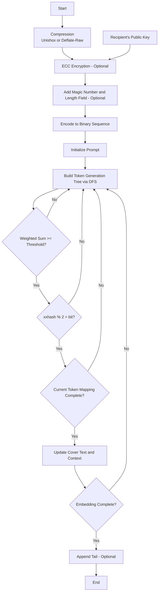

[简体中文](README.md) | [English](README_en.md)

# StegLLM

StegLLM is an offline text steganography project that leverages large language models (LLMs) to hide secret information within normal text. It requires no installation or configuration and allows for secure steganographic encryption locally.

## What is Text Steganography?

Imagine being able to hide a sentence inside an article without anyone easily noticing it.

That’s text steganography: embedding the information you want to conceal into seemingly ordinary text.

Unlike encryption, the core of steganography is **to make people unaware of the existence of the hidden information**.

## What Are the “Wonders” of Text Steganography?

*   **Sharing Little Secrets:** Want to send a secret message to a friend that only you two understand? Hide it in a piece of seemingly ordinary text, leaving others completely unaware.
*   **Adding an “Authenticity Code” to Your Work:** In a novel you’ve poured your heart into, secretly embed some “Easter eggs” that only you know about, proving it’s your original creation.
*   **Hide-and-Seek Game:** In public settings, you might want to make certain information “invisible” by embedding it into ordinary content. It’s like playing hide-and-seek—see who can find it!
*   **Code Pranks:** Want your program to perform special operations “without anyone knowing”? Hide secret instructions in a mundane log file or code comment, giving your program covert tasks!

# Quick Start

Download [StegLLM.zip](https://github.com/Rin313/StegLLM/releases)

For Windows: Run `windows.bat`

For Linux/MacOS: Run `linux_mac.sh`

Interface Demo

As shown in the image, simply input the content you want to hide along with a steganography prompt, and a natural piece of text will be generated.

# Using a Custom Model (Optional)

Obtain a **gguf** file from sources like **Hugging Face** or **ModelScope**, then replace the gguf file in the **data** folder of the project directory.

# Workflow Diagram

# Contributing

We welcome Issues and Pull Requests!

# Disclaimer

This project is intended solely for learning and research purposes. Please do not use it for illegal activities. The author assumes no responsibility for any loss or damage caused by the use of this project.

This project is licensed under the [MIT License](LICENSE).

Special Thanks: **[LLM-Steganography](https://github.com/HighDoping/LLM-Steganography/), [llamafile](https://github.com/Mozilla-Ocho/llamafile), [Unishox2](https://github.com/siara-cc/Unishox2)**