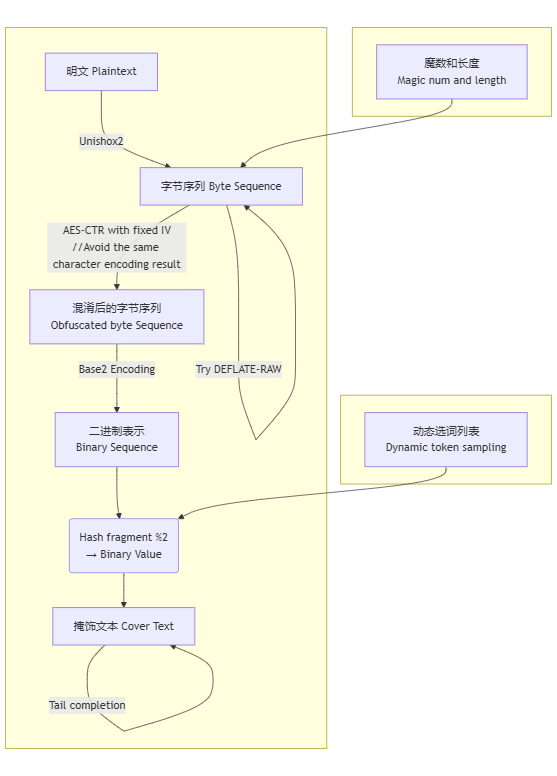

[简体中文](README.md) | [English](README_en.md)
# StegLLM

StegLLM is an offline text steganography project that leverages large language models (LLMs) to hide secret information within ordinary text. No installation or configuration is required, allowing for secure steganographic encryption locally.

## What is Text Steganography?

Imagine being able to hide a sentence within an article without anyone easily noticing.

This is text steganography: embedding the information you want to conceal into seemingly normal text.

Unlike encryption, the core of steganography is **to make the existence of the information completely undetectable**.

## What Are the "Cool Uses" of Text Steganography?

*   **Sharing Little Secrets:** Want to send a "secret only we understand" to a friend? Hide it in a piece of seemingly ordinary text, making it completely undetectable to others.
*   **Adding a "Watermark" to Your Work:** In a novel you've poured your heart into, secretly embed some "Easter eggs" only you know about to prove it's your original creation.
*   **Playing Hide-and-Seek:** In public settings, you might want to make certain information "invisible" by embedding it into ordinary content. It's like playing hide-and-seek—see who can find me!

# Quick Start

* **For both steganography and decryption:** Download [StegLLM.zip](https://github.com/Rin313/StegLLM/releases)
* **For decryption only:** Download [StegLLM-pure.zip](https://github.com/Rin313/StegLLM/releases)

Windows: Run `windows.bat`

Linux/MacOS:
1. Execute the following commands in the project directory:
```bash
chmod +x linux_mac.sh data/*.llamafile
```
2. Run `linux_mac.sh`

Here is a simple example


As shown in the figure, a sentence that you want to hide can be encrypted into a plain text, and supports **arbitrary insertion of text at the beginning and end**, which means you can insert the result into any text or conversation.

# Using a Custom Model (Optional)

1. Download [StegLLM-pure.zip](https://github.com/Rin313/StegLLM/releases)
2. Obtain the desired llamafile from any source, such as **Hugging Face** or **ModelScope**, and place it in the **data** folder under the project directory.

The default model used is `Qwen2.5-0.5B-Instruct-Q6_K`. Using models with larger parameters typically results in better steganographic performance.

**Notes for Windows Users:**

If running a llamafile larger than 4GB on Windows, additional steps are required. Please refer to the official documentation at [Mozilla-Ocho/llamafile](https://github.com/Mozilla-Ocho/llamafile).

# Continuation Prompt Settings (Optional)

Configure `settings.txt`

```javascript
const prompts=[
    `Continue writing an essay:`,
    `Continue writing a fantasy novel:`,
    `Continue writing a modern poem:`,
];
```

# AI Role Settings (Optional)

Configure `system_prompt.txt`

```json
{
  "system_prompt": {
    "prompt": "You are an assistant skilled in text continuation. Your task is to continue the provided text naturally and creatively, without asking questions, providing hints, stating task requirements, adding explanations, comments, or supplementary remarks. Your continuation should always follow natural language expression and allow blank input.",
    "assistant_name": "Continuation Assistant:"
  }
}
```

# Diagram



# Contribution

Feel free to submit Issues and Pull Requests!

# Disclaimer

This project is intended for learning and research purposes only. Do not use it for illegal activities. The author is not responsible for any loss or damage caused by the use of this project.

This project is licensed under the [MIT License](LICENSE).

Special thanks to: **[LLM-Steganography](https://github.com/HighDoping/LLM-Steganography/), [llamafile](https://github.com/Mozilla-Ocho/llamafile), [Unishox2](https://github.com/siara-cc/Unishox2)**