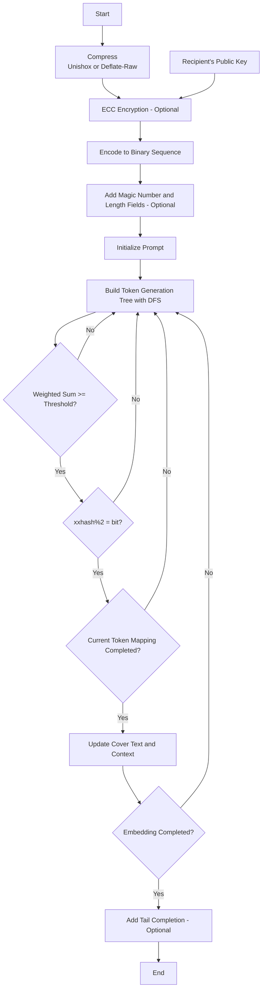

[简体中文](README.md) | [English](README_en.md)

# StegLLM

StegLLM is an offline text steganography project that leverages large language models (LLMs) to hide secret information in natural text. No installation or configuration is required—steganographic encryption can be performed securely on your local machine.

## What is Text Steganography?

Imagine being able to quietly hide a sentence inside an article, without anyone easily noticing.

That’s exactly what text steganography is: embedding information you want to hide within seemingly ordinary text.

Unlike encryption, the core idea of steganography is to **make people unaware that any information is hidden at all**.

## What Can You Do with Text Steganography?

*   **Send Secret Messages:** Want to send your friend a little secret that only the two of you understand? Hide it in a seemingly normal passage, so nobody else can tell.
*   **Add a "Watermark" to Your Work:** Embed a secret "Easter egg" that only you know in your painstakingly written novel, to prove it’s your original creation.
*   **Play Hide-and-Seek:** Sometimes, in public settings, you may want some information to “disappear” into ordinary content—like playing hide-and-seek, and seeing who can find it!
*   **Code Pranks:** Want your program to perform special operations "without anyone knowing"? Hide secret instructions inside ordinary log files or code comments, giving your program hidden tasks!

# Quick Start

* **Steganography + Decryption:**

Download [StegLLM.zip](https://github.com/Rin313/StegLLM/releases)

For Windows: run `windows.bat`

For Linux/MacOS: run `linux_mac.sh`
* **Decryption Only:** Use https://rin313.github.io/StegLLM/

UI Demo


As shown above, simply input the content you wish to hide and a steganographic prompt to generate a natural-looking text.

# Using a Custom Model (Optional)

Obtain a **gguf** file from any source, such as **Hugging Face** or **ModelScope**, and replace the gguf file in the **data** folder within the project directory.

# Deploy to Android (Beta)
Using **Termux**
```sh
apt update && apt upgrade -y
apt install git cmake
git clone https://github.com/ggml-org/llama.cpp
cd llama.cpp
cmake -B build
cmake --build build --config Release
curl --compressed -LO https://github.com/Rin313/StegLLM/releases/download/v1.2.1/StegLLM.zip
unzip StegLLM.zip
cp -r llama.cpp/build/bin StegLLM/data/
bash StegLLM/android.sh
```

# Flowchart



# Contribution

Issues and Pull Requests are welcome!

# Disclaimer

This project is for educational and research purposes only. Please do not use it for illegal activities. The author assumes no liability for any loss or damage resulting from the use of this project.

Special thanks to: **[LLM-Steganography](https://github.com/HighDoping/LLM-Steganography/), [llama.cpp](https://github.com/ggml-org/llama.cpp), [Unishox2](https://github.com/siara-cc/Unishox2)**