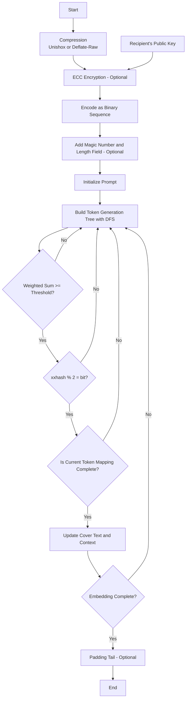

[简体中文](README.md) | [English](README_en.md)

# StegLLM

StegLLM is an offline text steganography project that leverages large language models to hide secret information within normal text. It requires no installation or configuration and is cross-platform compatible.

## What is Text Steganography?

Imagine being able to secretly hide a sentence within an article without anyone easily noticing.

This is text steganography: embedding the information you want to hide into seemingly ordinary text.

Unlike encryption, the core of steganography is **to make people unaware that the information even exists**.

## What are the "Wonderful Uses" of Text Steganography?

- **Passing Little Secrets**:  
  Want to send a "secret only we understand" to a friend? Hide it in a piece of seemingly ordinary text, making it completely undetectable to others.
- **Adding an "Anti-Counterfeiting Code" to Your Work**:  
  In a novel you poured your heart into, secretly embed some "Easter eggs" that only you know about, proving it’s your original creation.
- **Hide-and-Seek Game**:  
  In public settings, you might want to make certain information "invisible" by hiding it within ordinary content. It’s like playing hide-and-seek—let’s see who can find me!
- **Code Pranks**:  
  Want your program to perform special operations "without anyone knowing"? Hide secret instructions in an ordinary log file or code comment, giving your program covert tasks!

## Quick Start

- **Decryption Only:** Visit https://rin313.github.io/StegLLM/

This is a webpage with only decryption functionality, but you can see a basic demo interface here.

- **Steganography + Decryption:**

Download [StegLLM.zip](https://github.com/Rin313/StegLLM/releases)

For Windows: Run `windows.bat`

For Linux/MacOS: Run `linux_mac.sh`

## Using a Custom Model (Optional)

Obtain a **gguf** file from any source, such as **Hugging Face** or **ModelScope**, and replace the gguf file in the **data** folder of the project directory.

## Deploying to Android (Beta)

Using **Termux**:

```sh
apt update && apt upgrade -y
apt install git cmake
git clone --depth 1 https://github.com/ggml-org/llama.cpp
cd llama.cpp
cmake -B build
cmake --build build --config Release -t -server
cd ..
curl --insecure --compressed -C - -LO https://github.com/Rin313/StegLLM/releases/download/v1.3.0/StegLLM.zip
unzip StegLLM.zip
cp -r llama.cpp/build/bin StegLLM/data/
bash StegLLM/android.sh
```

## Workflow Diagram



## Contributing

We welcome Issues and Pull Requests!

## Disclaimer

This project is intended for learning and research purposes only. Please do not use it for illegal activities. The author assumes no responsibility for any loss or damage caused by the use of this project. Special thanks to: **[LLM-Steganography](https://github.com/HighDoping/LLM-Steganography/), [llama.cpp](https://github.com/ggml-org/llama.cpp), [Unishox2](https://github.com/siara-cc/Unishox2)**.
