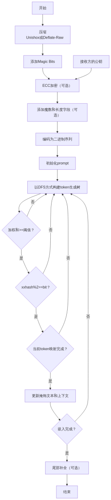

[简体中文](README.md) | [English](README_en.md)
# StegLLM

StegLLM is an offline text steganography project that leverages large language models (LLMs) to hide secret information within normal text. It requires no installation or configuration, allowing for secure steganographic encryption locally.

## What is Text Steganography?

Imagine being able to secretly hide a sentence within an article without anyone easily noticing.

That’s text steganography: embedding the information you want to hide into seemingly ordinary text.

Unlike encryption, the core of steganography is **making people unaware of the existence of the hidden information**.

## What “Wonders” Can Text Steganography Do?

*   **Share Little Secrets:** Want to send a “secret only we understand” to a friend? Hide it in a piece of seemingly ordinary text, leaving others completely unaware.
*   **Add an “Authenticity Code” to Your Work:** In a novel you poured your heart into, secretly embed some “easter eggs” only you know about to prove it’s your original creation.
*   **Hide-and-Seek Game:** In public settings, you might want to make certain information “invisible” by embedding it into ordinary content. It’s like playing hide-and-seek—see who can find it!
*   **Code Pranks:** Want your program to perform special operations “without anyone knowing”? Hide secret instructions in an ordinary log file or code comment, giving your program covert tasks!

# Quick Start

Download [StegLLM.zip](https://github.com/Rin313/StegLLM/releases)

For Windows: Run `windows.bat`

For Linux/MacOS: Run `linux_mac.sh`

Interface Demo


As shown in the image, simply input the content you want to hide and a steganography prompt to generate a natural piece of text.

# Using a Custom Model (Optional)

Obtain a **gguf** file from sources like **Hugging Face** or **ModelScope**, then replace the gguf file in the **data** folder of the project directory.

# AI Role Configuration (Optional)

Configure `system_prompt.txt`

```json
{
  "system_prompt": {
    "prompt": "You are a creative writing assistant. Your task is to continue the input text in a natural, fluent, and imaginative way, following the style and tone of the input. If the input is empty, start a new story or paragraph creatively. Ensure your continuation is grammatically correct and engaging, using natural language expressions.",
    "assistant_name": "Continuation Assistant:"
  }
}
```

# Diagram of the Workflow



# Contributing

We welcome Issues and Pull Requests!

# Disclaimer

This project is intended solely for learning and research purposes. Please do not use it for illegal activities. The author assumes no responsibility for any loss or damage caused by the use of this project.

This project is licensed under the [MIT License](LICENSE).

Special thanks to: **[LLM-Steganography](https://github.com/HighDoping/LLM-Steganography/), [llamafile](https://github.com/Mozilla-Ocho/llamafile), [Unishox2](https://github.com/siara-cc/Unishox2)**